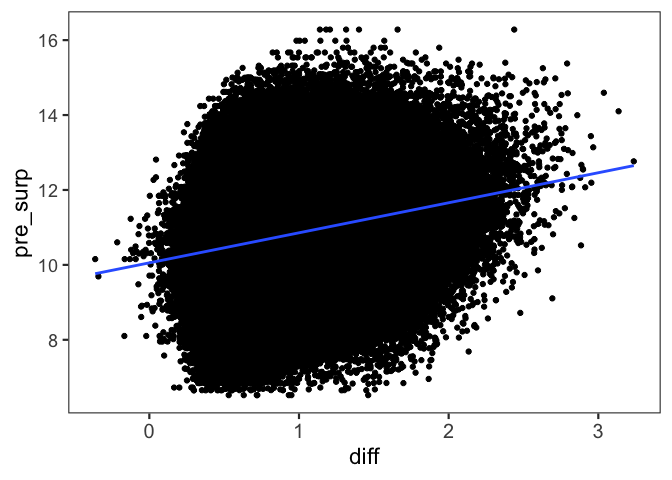
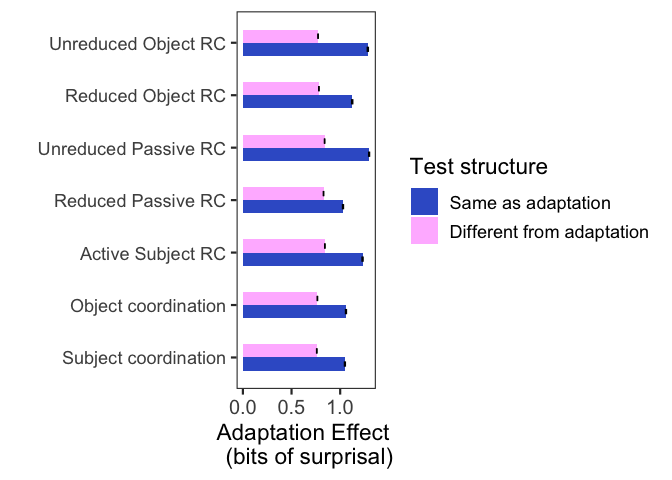
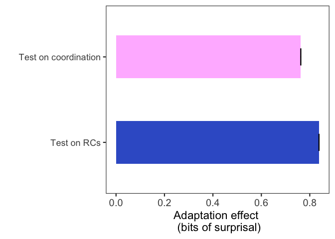
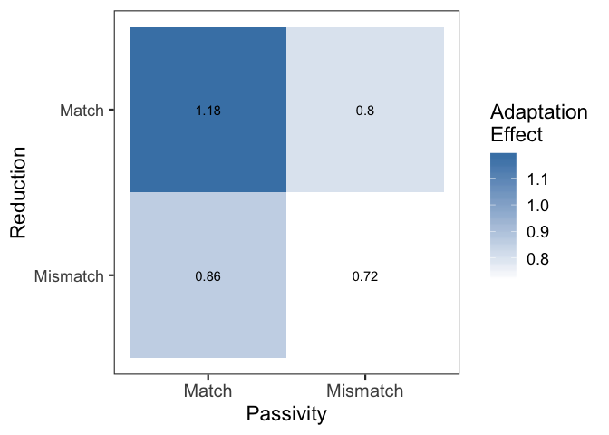
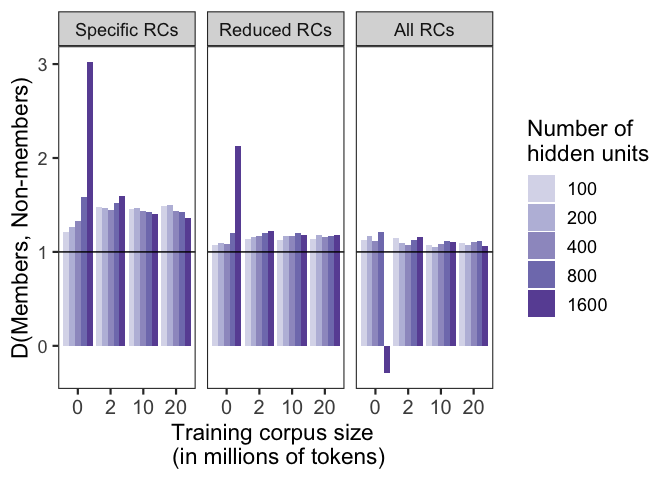
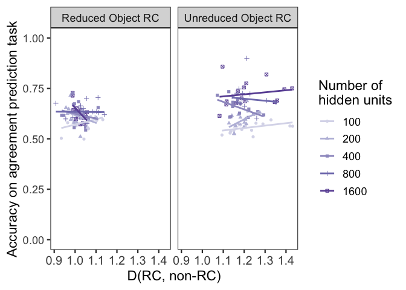
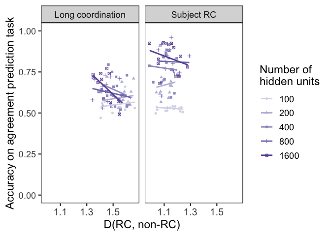

Using Priming to Uncover the Organization of Syntactic Representations in Neural Language Models
================

**Defining functions**

``` r
data_summary <- function(data, varname, groupnames, ci = TRUE){
  require(plyr)
   length2 <- function (x, na.rm=FALSE) {
        if (na.rm) sum(!is.na(x))
        else       length(x)
    }

  data_sum <- data %>% group_by(.dots = groupnames) %>% summarise(N = length2(get(varname)), mean = mean(get(varname), na.rm = TRUE), sd = sd(get(varname), na.rm = TRUE)) %>% rename(!!varname := mean)
  

  if(ci==FALSE){
    return(data_sum)
  }
  else{
    data_sum$se <- data_sum$sd / sqrt(data_sum$N)

  ciMult <- qt(0.95/2 + .5, data_sum$N-1)
  data_sum$ci <- data_sum$se * ciMult
 return(data_sum)
  }
}
```

Set up
------

### Load in data from trained models

``` r
pre_summary <- readRDS('../data/dataframes/pre_alist6-10_summary_no.unk.Rda')
post_summary <- readRDS('../data/dataframes/post_alist6-10_summary_no.unk.Rda')

drop <- c("N", "sd", "se", "ci")

pre_summary <- pre_summary[,!(names(pre_summary) %in% drop)]
colnames(pre_summary)[colnames(pre_summary)=="pre_test"] <- "test"

post_summary <- post_summary[,!(names(post_summary) %in% drop)]
colnames(post_summary)[colnames(post_summary)=="post_test"] <- "test"

pre20 <- subset(pre_summary, amt == 20)
post20 <- subset(post_summary, amt == 20)


# Merge pre20 and post20
pre20$merge1 <- paste(pre20$sentid, pre20$csize, pre20$clist, pre20$nhid, pre20$adaptlist, pre20$test, sep = '')

post20$merge1 <- paste(post20$sentid, post20$csize, post20$clist, post20$nhid, post20$adaptlist, post20$test, sep = '')

all20 <- merge(post20, pre20, by='merge1')

colnames(all20)[2:8] <- c('sentid', 'csize', 'clist', 'nhid', 'adaptlist', 'test', 'amt')
drop <- c('sentid.y', 'csize.y', 'clist.y', 'nhid.y', 'adaptlist.y', 'test.y', 'amt.y')
all20 <- all20[,!(names(all20) %in% drop)]


# Add relevant diff columns

strucs = c('orc', 'orrc', 'prc', 'prrc','src', 'ocont','scont')

# Reordering levels for correct RSM plotting
all20$test <- factor(all20$test, levels = strucs)
all20$adapt = factor(all20$adapt, levels = rev(strucs))
```

### Add in useful variables

``` r
all20$diagonal <- ifelse(all20$adapt == all20$test, 'diagonal', 'not-diagonal')

rcs <- c('orc','orrc','prc','prrc','src')

all20$testRC <- ifelse(all20$test %in% rcs, 'Test on RCs', 'Test on coordination')
all20$testRC <- factor(all20$testRC, levels = c('Test on RCs', 'Test on coordination'))

all20$adaptRC <- ifelse(all20$adapt %in% rcs, 'Adapted to RCs', 'Adapted to coordination')
all20$adaptRC <- factor(all20$adaptRC, levels = c('Adapted to RCs', 'Adapted to coordination'))
```

Calculating the adaptation effect
---------------------------------

``` r
# Adapt(Y | X)
all20$diff <- all20$pre_surp - all20$post_surp   

## Plotting the relationship between diff and pre_surp

p <- ggplot(all20, aes(x = diff, y = pre_surp)) + geom_point() + geom_smooth(method='lm') + labs(x = 'A(Y|X)', y = 'Surp(Y)')
p
```



``` r
ggsave('presurp_diff.pdf', plot = p, device = "pdf", path = '../conll-plots/', width = 7, height = 3.5, units = "in")

# Fitting model for Adapt(Y | X) ~ Surp(Y)
model <- lm(diff ~ scale(pre_surp, scale = FALSE), data = all20)
summary(model)
```

    ## 
    ## Call:
    ## lm(formula = diff ~ scale(pre_surp, scale = FALSE), data = all20)
    ## 
    ## Residuals:
    ##      Min       1Q   Median       3Q      Max 
    ## -1.17517 -0.22617 -0.05349  0.17181  2.26248 
    ## 
    ## Coefficients:
    ##                                 Estimate Std. Error t value Pr(>|t|)    
    ## (Intercept)                    0.8492754  0.0003233  2627.2   <2e-16 ***
    ## scale(pre_surp, scale = FALSE) 0.0617111  0.0002822   218.7   <2e-16 ***
    ## ---
    ## Signif. codes:  0 '***' 0.001 '**' 0.01 '*' 0.05 '.' 0.1 ' ' 1
    ## 
    ## Residual standard error: 0.3098 on 918748 degrees of freedom
    ## Multiple R-squared:  0.04948,    Adjusted R-squared:  0.04948 
    ## F-statistic: 4.782e+04 on 1 and 918748 DF,  p-value: < 2.2e-16

``` r
# AE(Y | X)
all20$corrected_diff <- residuals(model) + coef(model)["(Intercept)"]
```

### Analysis 1: Validating AE as a similarity metric

#### Creating Figure 2a

``` r
labs <- c(
  'Unreduced Object RC',
  'Reduced Object RC',
  'Unreduced Passive RC',
  'Reduced Passive RC',
  'Active Subject RC',
  'Object coordination',
  'Subject coordination'
)

summ_analysis1 <- data.frame(NULL)

for(struc in strucs){
  curr <- subset(all20, adapt == struc)
  curr$structure <- ifelse(curr$test == struc, 'same', 'different')
  curr$structure <- factor(curr$structure, levels = c('same', 'different'))
  curr_summ <- data_summary(curr, 'corrected_diff', .(structure))
  curr_summ$struc <- struc
  summ_analysis1 <- rbind(summ_analysis1, curr_summ)
}


summ_analysis1$struc <- factor(summ_analysis1$struc, levels = rev(c('orc', 'orrc', 'prc', 'prrc','src', 'ocont','scont')))

p <- ggplot(summ_analysis1, aes(struc,corrected_diff, fill = structure, group = structure)) + geom_bar(stat='identity', width=0.5, position=position_dodge(width=0.5))   + geom_errorbar(aes(ymin=corrected_diff - ci, ymax=corrected_diff + ci),  width = 0.2, position = position_dodge(0.5))  + coord_flip() + scale_x_discrete(labels = rev(labs)) + labs(x='', y='Adaptation Effect \n (bits of surprisal)', fill = 'Test structure') +  scale_fill_manual(values = c('royalblue3', 'plum1'), labels = c('Same as adaptation', 'Different from adaptation'))

p
```



``` r
ggsave('analysis1.pdf', plot = p, device = "pdf", path = '../conll-plots/', width = 7, height = 3.5, units = "in")
```

#### Running statistical analyses

``` r
all_analysis1 <- data.frame(NULL)

strucs = c('orc', 'orrc', 'prc', 'prrc','src', 'ocont','scont')

for(struc in strucs){
  curr <- subset(all20, adapt == struc)
  curr$structure <- ifelse(curr$test == struc, 'same', 'different')
  curr$structure <- factor(curr$structure, levels = c('same', 'different'))

  contrasts(curr$structure) <- "contr.sum"

  curr_model <- lmer(corrected_diff ~ structure + (1 | adaptlist) + (1 | clist), curr)

  curr_ests <- c(coef(summary(curr_model))[, "Estimate"], coef(summary(curr_model))[, "Std. Error"], coef(summary(curr_model))[, "t value"], coef(summary(curr_model))[, "Pr(>|t|)"])

  all_analysis1 <- rbind(all_analysis1, curr_ests)
}

colnames(all_analysis1) <- c('intercept.est', 'structure.est', 'intercept.se','structure.se', 'intercept.tval', 'structure.tval', 'intercept.pval', 'structure.pval')

all_analysis1$struc <- strucs

print(paste(all_analysis1$struc, all_analysis1$structure, round(all_analysis1$structure.est, 3), round(all_analysis1$structure.se, 3), all_analysis1$structure.pval))
```

    ## [1] "orc  0.256 0.001 0"   "orrc  0.171 0.001 0"  "prc  0.229 0.001 0"  
    ## [4] "prrc  0.1 0.001 0"    "src  0.194 0.001 0"   "ocont  0.147 0.001 0"
    ## [7] "scont  0.145 0.001 0"

### Analysis 2: Similarity between sentences with different types of VP coordination

#### Creating Figure 2b upper panel

``` r
no_diagonal <- subset(all20, diagonal != 'diagonal')

no_diagonal$sameRC <- factor(ifelse(no_diagonal$adapt %in% rcs & no_diagonal$test %in% rcs, 'same', 
                       ifelse(!(no_diagonal$adapt %in% rcs | no_diagonal$test %in% rcs), 'same', 'different')), levels = c('same', 'different'))

no_diagonal$adaptRC <- factor(ifelse(no_diagonal$adapt %in% rcs, 'Adapt on RC', 'Adapt on coordination'), levels = c('Adapt on RC', 'Adapt on coordination'))

summ_analysis2_no.diagonal <- data_summary(no_diagonal, 'corrected_diff', .(sameRC, adaptRC, testRC))

ggplot(subset(summ_analysis2_no.diagonal, adaptRC == 'Adapt on coordination'), aes(testRC, corrected_diff, group = testRC, fill = sameRC)) +  geom_bar(stat='identity', width=0.5) + geom_errorbar(aes(ymin=corrected_diff - ci, ymax=corrected_diff + ci),  width = 0.2, position = position_dodge(0.9)) + theme(legend.position = "none") + labs(x = '', y = 'Adaptation effect \n (bits of surprisal)') + coord_flip() + scale_fill_manual(values = c('royalblue3', 'plum1'))
```


#### Statistical analyses

``` r
contrasts(no_diagonal$testRC) <- "contr.sum"
contrasts(no_diagonal$testRC)
```

    ##                      [,1]
    ## Test on RCs             1
    ## Test on coordination   -1

``` r
analysis2 <- lmer(corrected_diff ~ testRC +  (1 | adaptlist) + (1 | clist), subset(no_diagonal, !(adapt %in% rcs)))
summary(analysis2)
```

    ## Linear mixed model fit by REML. t-tests use Satterthwaite's method [
    ## lmerModLmerTest]
    ## Formula: corrected_diff ~ testRC + (1 | adaptlist) + (1 | clist)
    ##    Data: subset(no_diagonal, !(adapt %in% rcs))
    ## 
    ## REML criterion at convergence: 8922.4
    ## 
    ## Scaled residuals: 
    ##     Min      1Q  Median      3Q     Max 
    ## -3.4247 -0.7045 -0.1372  0.5721  6.0703 
    ## 
    ## Random effects:
    ##  Groups    Name        Variance  Std.Dev.
    ##  adaptlist (Intercept) 6.513e-05 0.00807 
    ##  clist     (Intercept) 1.161e-03 0.03407 
    ##  Residual              6.090e-02 0.24678 
    ## Number of obs: 225000, groups:  adaptlist, 5; clist, 5
    ## 
    ## Fixed effects:
    ##               Estimate Std. Error         df t value Pr(>|t|)    
    ## (Intercept)  8.780e-01  1.568e-02  4.454e+00   56.01 1.62e-07 ***
    ## testRC1     -1.729e-01  6.980e-04  2.250e+05 -247.75  < 2e-16 ***
    ## ---
    ## Signif. codes:  0 '***' 0.001 '**' 0.01 '*' 0.05 '.' 0.1 ' ' 1
    ## 
    ## Correlation of Fixed Effects:
    ##         (Intr)
    ## testRC1 -0.030

### Analysis 3: Similarity between sentences with different types of RCs

#### Creating Figure 2b lower panel

``` r
ggplot(subset(summ_analysis2_no.diagonal, adaptRC == 'Adapt on RC'), aes(testRC, corrected_diff, group = testRC, fill = sameRC)) +  geom_bar(stat='identity', width=0.5) + geom_errorbar(aes(ymin=corrected_diff - ci, ymax=corrected_diff + ci),  width = 0.2, position = position_dodge(0.9)) + theme(legend.position = "none") + labs(x = '', y = 'Adaptation effect \n (bits of surprisal)') + coord_flip() + scale_fill_manual(values = c('royalblue3', 'plum1'))
```



#### Statistical analyses

``` r
contrasts(no_diagonal$testRC)
```

    ##                      [,1]
    ## Test on RCs             1
    ## Test on coordination   -1

``` r
analysis3 <- lmer(corrected_diff ~ testRC +  (1 | adaptlist) + (1 | clist), subset(no_diagonal, adapt %in% rcs))
summary(analysis3)
```

    ## Linear mixed model fit by REML. t-tests use Satterthwaite's method [
    ## lmerModLmerTest]
    ## Formula: corrected_diff ~ testRC + (1 | adaptlist) + (1 | clist)
    ##    Data: subset(no_diagonal, adapt %in% rcs)
    ## 
    ## REML criterion at convergence: 75869.2
    ## 
    ## Scaled residuals: 
    ##     Min      1Q  Median      3Q     Max 
    ## -4.1322 -0.7272 -0.1300  0.5979  6.3124 
    ## 
    ## Random effects:
    ##  Groups    Name        Variance Std.Dev.
    ##  adaptlist (Intercept) 0.000195 0.01397 
    ##  clist     (Intercept) 0.000993 0.03151 
    ##  Residual              0.066995 0.25883 
    ## Number of obs: 562500, groups:  adaptlist, 5; clist, 5
    ## 
    ## Fixed effects:
    ##              Estimate Std. Error        df t value Pr(>|t|)    
    ## (Intercept) 8.005e-01  1.542e-02 5.509e+00   51.91 1.26e-08 ***
    ## testRC1     3.763e-02  3.660e-04 5.625e+05  102.81  < 2e-16 ***
    ## ---
    ## Signif. codes:  0 '***' 0.001 '**' 0.01 '*' 0.05 '.' 0.1 ' ' 1
    ## 
    ## Correlation of Fixed Effects:
    ##         (Intr)
    ## testRC1 -0.008

### Analysis 4: Similarity between sentences belonging to different sub-classes of RCs

#### Creating Figure 3

``` r
passive_object <- subset(all20, adapt %in% c('prc', 'prrc', 'orc', 'orrc') & test %in% c('prc', 'prrc', 'orc', 'orrc'))

passive_object$adapt.passive <- ifelse(passive_object$adapt %in% c('prc', 'prrc'), 'passive', 'object')
passive_object$test.passive <- ifelse(passive_object$test %in% c('prc', 'prrc'), 'passive', 'object')
passive_object$adapt.reduced <- ifelse(passive_object$adapt %in% c('prc', 'orc'), 'Unreduced RC', 'Reduced RC')
passive_object$test.reduced <- ifelse(passive_object$test %in% c('prc', 'orc'), 'Unreduced RC', 'Reduced RC')

passive_object$isPassive <- ifelse(passive_object$adapt.passive == passive_object$test.passive, 'Match', 'Mismatch')

passive_object$isReduced <- ifelse(passive_object$adapt.reduced == passive_object$test.reduced, 'Match', 'Mismatch')

passive_object_summ <- data_summary(passive_object, 'corrected_diff', .(isPassive, isReduced))
passive_object_summ$isPassive <- factor(passive_object_summ$isPassive, levels = c('Match', 'Mismatch'))
passive_object_summ$isReduced <- factor(passive_object_summ$isReduced, levels = rev(c('Match', 'Mismatch')))

p <- ggplot(passive_object_summ, mapping = aes(x=isPassive, y=isReduced)) + geom_tile(aes(fill=corrected_diff)) +scale_fill_gradient(low = 'white',  high = 'steelblue') + labs(fill = 'Adaptation\nEffect', x='Passivity', y='Reduction') + geom_text(aes(label=round(corrected_diff, 2)))

p
```



``` r
ggsave('analysis4.pdf', plot = p, device = "pdf", path = '../conll-plots/', width = 5, height = 3.5, units = "in")
```

#### Statistical analyses

``` r
passive_object$adapttest <- paste(passive_object$adapt, passive_object$test, sep = '')

passive_object$testtype <-  ifelse(passive_object$adapttest %in% c('prrcprrc', 'orrcorrc','prcprc', 'orcorc'), 'both match', 
                                   ifelse(passive_object$adapttest %in% c('prrcorrc', 'orrcprrc','prcorc', 'orcprc'), 'reduced match', 
                                          ifelse(passive_object$adapttest %in% c('prrcprc', 'orrcorc','prcprrc', 'orcorrc'), 'passive match', 'no match' )))

passive_object$testtype <- factor(passive_object$testtype, levels = c('passive match', 'reduced match', 'both match', 'no match'))

contrasts(passive_object$testtype)
```

    ##               reduced match both match no match
    ## passive match             0          0        0
    ## reduced match             1          0        0
    ## both match                0          1        0
    ## no match                  0          0        1

``` r
analysis4_combined <- lmer(corrected_diff ~ testtype + (1 | adaptlist) + (1 | clist), passive_object)

summary(analysis4_combined)
```

    ## Linear mixed model fit by REML. t-tests use Satterthwaite's method [
    ## lmerModLmerTest]
    ## Formula: corrected_diff ~ testtype + (1 | adaptlist) + (1 | clist)
    ##    Data: passive_object
    ## 
    ## REML criterion at convergence: 86726.5
    ## 
    ## Scaled residuals: 
    ##     Min      1Q  Median      3Q     Max 
    ## -4.2086 -0.6821 -0.1023  0.5860  6.7954 
    ## 
    ## Random effects:
    ##  Groups    Name        Variance  Std.Dev.
    ##  adaptlist (Intercept) 0.0005422 0.02328 
    ##  clist     (Intercept) 0.0011802 0.03435 
    ##  Residual              0.0781515 0.27956 
    ## Number of obs: 300000, groups:  adaptlist, 5; clist, 5
    ## 
    ## Fixed effects:
    ##                         Estimate Std. Error         df t value Pr(>|t|)
    ## (Intercept)            8.593e-01  1.859e-02  7.062e+00   46.23 4.98e-10
    ## testtypereduced match -5.845e-02  1.444e-03  3.000e+05  -40.49  < 2e-16
    ## testtypeboth match     3.242e-01  1.444e-03  3.000e+05  224.54  < 2e-16
    ## testtypeno match      -1.432e-01  1.444e-03  3.000e+05  -99.23  < 2e-16
    ##                          
    ## (Intercept)           ***
    ## testtypereduced match ***
    ## testtypeboth match    ***
    ## testtypeno match      ***
    ## ---
    ## Signif. codes:  0 '***' 0.001 '**' 0.01 '*' 0.05 '.' 0.1 ' ' 1
    ## 
    ## Correlation of Fixed Effects:
    ##             (Intr) tsttyprm tsttypbm
    ## tsttyprdcdm -0.039                  
    ## tsttypbthmt -0.039  0.500           
    ## tsttypnmtch -0.039  0.500    0.500

### Analysis 5: Effect of model size and training corpus size on the similarity between sentences

#### Loading in models with no training

``` r
## Load data
zero_pre_summary <- readRDS('../data/dataframes/pre_summary_zero_nounk.Rda')
zero_post_summary <- readRDS('../data/dataframes/post_summary_zero_nounk.Rda')

zero_pre_summary <- subset(zero_pre_summary, adaptlist > 5)
colnames(zero_pre_summary)[colnames(zero_pre_summary)=="pre_test"] <- "test"

zero_post_summary <- subset(zero_post_summary, adaptlist > 5)
colnames(zero_post_summary)[colnames(zero_post_summary)=="post_test"] <- "test"

zero_pre_summary$merge1 <- paste(zero_pre_summary$sentid, zero_pre_summary$nhid, zero_pre_summary$adaptlist, zero_pre_summary$test, sep = '')

zero_post_summary$merge1 <- paste(zero_post_summary$sentid, zero_post_summary$nhid, zero_post_summary$adaptlist, zero_post_summary$test, sep = '')

all_zero <- merge(zero_pre_summary,zero_post_summary, by='merge1')

colnames(all_zero)[2:5] <- c('sentid',  'nhid', 'adaptlist', 'test')
drop <- c('sentid.y', 'csize.y', 'clist.y', 'nhid.y', 'adaptlist.y', 'test.y', 'amt.y')
all_zero <- all_zero[,!(names(all_zero) %in% drop)]

## Add variables
all_zero$testRC <- ifelse(all_zero$test %in% rcs, 'Test on RCs', 'Test on coordination')
all_zero$testRC <- factor(all_zero$testRC, levels = c('Test on RCs', 'Test on coordination'))

all_zero$adaptRC <- ifelse(all_zero$adapt %in% rcs, 'Adapted to RCs', 'Adapted to coordination')
all_zero$adaptRC <- factor(all_zero$adaptRC, levels = c('Adapted to RCs', 'Adapted to coordination'))

all_zero$diagonal <- ifelse(all_zero$adapt == all_zero$test, 'diagonal', 'not-diagonal')

## Calculate adaptation effect
all_zero$diff <- all_zero$pre_surp - all_zero$post_surp

model_zero <- lm(diff ~ scale(pre_surp, scale = FALSE), data = all_zero)
summary(model_zero)
```

    ## 
    ## Call:
    ## lm(formula = diff ~ scale(pre_surp, scale = FALSE), data = all_zero)
    ## 
    ## Residuals:
    ##      Min       1Q   Median       3Q      Max 
    ## -23.2550  -1.0999  -0.0514   1.0794  25.7753 
    ## 
    ## Coefficients:
    ##                                 Estimate Std. Error t value Pr(>|t|)    
    ## (Intercept)                    2.5570784  0.0024238    1055   <2e-16 ***
    ## scale(pre_surp, scale = FALSE) 0.2063542  0.0001818    1135   <2e-16 ***
    ## ---
    ## Signif. codes:  0 '***' 0.001 '**' 0.01 '*' 0.05 '.' 0.1 ' ' 1
    ## 
    ## Residual standard error: 2.999 on 1531248 degrees of freedom
    ## Multiple R-squared:  0.4569, Adjusted R-squared:  0.4569 
    ## F-statistic: 1.288e+06 on 1 and 1531248 DF,  p-value: < 2.2e-16

``` r
# AE(Y | X)
all_zero$corrected_diff <- residuals(model_zero) + coef(model_zero)["(Intercept)"]
```

#### Creating Figure 5a

``` r
# RC vs. not RC
summ_analysis5.1 <- subset(all20, adapt %in% rcs & diagonal != 'diagonal')  %>% group_by(testRC, nhid, csize, clist, adaptlist) %>% summarise(corrected_diff = mean(corrected_diff)) %>% spread(key="testRC",value="corrected_diff") %>%  mutate(prop = `Test on RCs` / `Test on coordination`) %>%  group_by(nhid, csize) %>% summarise(prop = mean(prop))

summ_analysis5.1_zero <- subset(all_zero, adapt %in% rcs & diagonal != 'diagonal')  %>% group_by(testRC, nhid,adaptlist) %>% summarise(corrected_diff = mean(corrected_diff)) %>% spread(key="testRC",value="corrected_diff") %>%  mutate(prop = `Test on RCs` / `Test on coordination`) %>%  group_by(nhid) %>% summarise(prop = mean(prop))

summ_analysis5.1_zero$csize <- 0

summ_analysis5.1 <- bind_rows(summ_analysis5.1, summ_analysis5.1_zero)
summ_analysis5.1$adapttype <- 'All RCs'


# Match vs. mismatch in reduction
all20$adaptReduced <- ifelse(all20$adapt %in% c('orrc', 'prrc'), 'reduced', 'unreduced')
all20$testReduced <- ifelse(all20$test %in% c('orrc', 'prrc'), 'reduced', 'unreduced')

all20$reduced <- ifelse(all20$adaptReduced == all20$testReduced, 'match', 'mismatch')

all_zero$adaptReduced <- ifelse(all_zero$adapt %in% c('orrc', 'prrc'), 'reduced', 'unreduced')
all_zero$testReduced <- ifelse(all_zero$test %in% c('orrc', 'prrc'), 'reduced', 'unreduced')

all_zero$reduced <- ifelse(all_zero$adaptReduced == all_zero$testReduced, 'match', 'mismatch')

summ_analysis5.2 <- subset(all20, adapt %in% rcs) %>% group_by(reduced, nhid, csize, clist, adaptlist) %>% summarise(corrected_diff = mean(corrected_diff)) %>% spread(key="reduced",value="corrected_diff") %>%  mutate(prop = `match` / `mismatch`) %>%  group_by(nhid, csize) %>% summarise(prop = mean(prop))

summ_analysis5.2_zero <- subset(all_zero, adapt %in% rcs) %>% group_by(reduced, nhid, adaptlist) %>% summarise(corrected_diff = mean(corrected_diff)) %>% spread(key="reduced",value="corrected_diff") %>%  mutate(prop = `match` / `mismatch`) %>%  group_by(nhid) %>% summarise(prop = mean(prop))

summ_analysis5.2_zero$csize <- 0
summ_analysis5.2 <- bind_rows(summ_analysis5.2, summ_analysis5.2_zero)

summ_analysis5.2$adapttype <- 'Reduced RCs' 


# Specific RC

summ_analysis5.3 <- subset(all20, adapt %in% rcs)  %>% group_by(diagonal, nhid, csize, clist, adaptlist) %>% summarise(corrected_diff = mean(corrected_diff)) %>% spread(key="diagonal",value="corrected_diff") %>%  mutate(prop = `diagonal` / `not-diagonal`) %>%  group_by(nhid, csize) %>% summarise(prop = mean(prop))

summ_analysis5.3_zero <- subset(all_zero, adapt %in% rcs)  %>% group_by(diagonal, nhid,adaptlist) %>% summarise(corrected_diff = mean(corrected_diff)) %>% spread(key="diagonal",value="corrected_diff") %>%  mutate(prop = `diagonal` / `not-diagonal`) %>%  group_by(nhid) %>% summarise(prop = mean(prop))

summ_analysis5.3_zero$csize <- 0

summ_analysis5.3 <- bind_rows(summ_analysis5.3, summ_analysis5.3_zero)
summ_analysis5.3$adapttype <- 'Specific RCs' 

summ_analysis5 <- rbind(summ_analysis5.1, summ_analysis5.2, summ_analysis5.3)
summ_analysis5$nhid <- factor(summ_analysis5$nhid)
summ_analysis5$csize <- factor(summ_analysis5$csize)

summ_analysis5$adapttype <- factor(summ_analysis5$adapttype, levels = c('Specific RCs', 'Reduced RCs', 'All RCs'))

purples = brewer.pal(n = 9, "Purples")[3:8]

p <- ggplot(subset(summ_analysis5) ,aes(x=csize, y = prop, fill = nhid)) + geom_bar(stat='identity',position='dodge') + scale_fill_manual(values = purples) + labs(x = 'Training corpus size \n (in millions of tokens)', y = 'D(Members, Non-members)', fill = 'Number of \nhidden units')  + facet_wrap(~adapttype) + geom_hline(yintercept = 1)

p
```



``` r
ggsave('analysis5.pdf', plot = p, device = "pdf", path = '../conll-plots/', width = 7, height = 3.5, units = "in")
```

#### Statistical analyses

``` r
# RC vs. not RC
analysis5.1 <- subset(all20, adapt %in% rcs & diagonal != 'diagonal')  %>% group_by(testRC, nhid, csize, clist, adaptlist) %>% summarise(corrected_diff = mean(corrected_diff)) %>% spread(key="testRC",value="corrected_diff") %>%  mutate(prop = `Test on RCs` / `Test on coordination`) 

model5.1 <- lmer(prop~scale(nhid)*scale(csize) + (1|clist) + (1|adaptlist), data = analysis5.1)
summary(model5.1)
```

    ## Linear mixed model fit by REML. t-tests use Satterthwaite's method [
    ## lmerModLmerTest]
    ## Formula: prop ~ scale(nhid) * scale(csize) + (1 | clist) + (1 | adaptlist)
    ##    Data: analysis5.1
    ## 
    ## REML criterion at convergence: -1125.1
    ## 
    ## Scaled residuals: 
    ##     Min      1Q  Median      3Q     Max 
    ## -2.8069 -0.6805 -0.0792  0.6252  3.4837 
    ## 
    ## Random effects:
    ##  Groups    Name        Variance  Std.Dev.
    ##  clist     (Intercept) 0.0001763 0.01328 
    ##  adaptlist (Intercept) 0.0002606 0.01614 
    ##  Residual              0.0025353 0.05035 
    ## Number of obs: 375, groups:  clist, 5; adaptlist, 5
    ## 
    ## Fixed effects:
    ##                            Estimate Std. Error         df t value Pr(>|t|)
    ## (Intercept)                1.099644   0.009703   6.773903 113.328 2.33e-12
    ## scale(nhid)                0.007661   0.002604 363.000018   2.942  0.00347
    ## scale(csize)              -0.011149   0.002604 363.000018  -4.282 2.37e-05
    ## scale(nhid):scale(csize)  -0.011532   0.002607 363.000018  -4.423 1.29e-05
    ##                             
    ## (Intercept)              ***
    ## scale(nhid)              ** 
    ## scale(csize)             ***
    ## scale(nhid):scale(csize) ***
    ## ---
    ## Signif. codes:  0 '***' 0.001 '**' 0.01 '*' 0.05 '.' 0.1 ' ' 1
    ## 
    ## Correlation of Fixed Effects:
    ##             (Intr) scl(n) scl(c)
    ## scale(nhid) 0.000               
    ## scale(csiz) 0.000  0.000        
    ## scl(nhd):() 0.000  0.000  0.000

``` r
# Match vs. mismatch in reduction
analysis5.2 <- subset(all20, adapt %in% rcs) %>% group_by(reduced, nhid, csize, clist, adaptlist) %>% summarise(corrected_diff = mean(corrected_diff)) %>% spread(key="reduced",value="corrected_diff") %>%  mutate(prop = `match` / `mismatch`) 

model5.2 <- lmer(prop~scale(nhid)*scale(csize) + (1|clist) + (1|adaptlist), data = analysis5.2)
summary(model5.2)
```

    ## Linear mixed model fit by REML. t-tests use Satterthwaite's method [
    ## lmerModLmerTest]
    ## Formula: prop ~ scale(nhid) * scale(csize) + (1 | clist) + (1 | adaptlist)
    ##    Data: analysis5.2
    ## 
    ## REML criterion at convergence: -1532.9
    ## 
    ## Scaled residuals: 
    ##      Min       1Q   Median       3Q      Max 
    ## -2.43180 -0.62723 -0.05289  0.59549  2.85204 
    ## 
    ## Random effects:
    ##  Groups    Name        Variance  Std.Dev.
    ##  clist     (Intercept) 0.0002352 0.01533 
    ##  adaptlist (Intercept) 0.0001553 0.01246 
    ##  Residual              0.0008282 0.02878 
    ## Number of obs: 375, groups:  clist, 5; adaptlist, 5
    ## 
    ## Fixed effects:
    ##                            Estimate Std. Error         df t value Pr(>|t|)
    ## (Intercept)                1.170211   0.008961   7.303151 130.593 1.43e-13
    ## scale(nhid)                0.016499   0.001488 363.000163  11.087  < 2e-16
    ## scale(csize)              -0.006190   0.001488 363.000163  -4.159 3.99e-05
    ## scale(nhid):scale(csize)  -0.008148   0.001490 363.000163  -5.468 8.49e-08
    ##                             
    ## (Intercept)              ***
    ## scale(nhid)              ***
    ## scale(csize)             ***
    ## scale(nhid):scale(csize) ***
    ## ---
    ## Signif. codes:  0 '***' 0.001 '**' 0.01 '*' 0.05 '.' 0.1 ' ' 1
    ## 
    ## Correlation of Fixed Effects:
    ##             (Intr) scl(n) scl(c)
    ## scale(nhid) 0.000               
    ## scale(csiz) 0.000  0.000        
    ## scl(nhd):() 0.000  0.000  0.000

``` r
# Specific RC
analysis5.3 <- subset(all20, adapt %in% rcs)  %>% group_by(diagonal, nhid, csize, clist, adaptlist) %>% summarise(corrected_diff = mean(corrected_diff)) %>% spread(key="diagonal",value="corrected_diff") %>%  mutate(prop = `diagonal` / `not-diagonal`) 

model5.3 <- lmer(prop~scale(nhid)*scale(csize) + (1|clist) + (1|adaptlist), data = analysis5.3)
summary(model5.3)
```

    ## Linear mixed model fit by REML. t-tests use Satterthwaite's method [
    ## lmerModLmerTest]
    ## Formula: prop ~ scale(nhid) * scale(csize) + (1 | clist) + (1 | adaptlist)
    ##    Data: analysis5.3
    ## 
    ## REML criterion at convergence: -1150.4
    ## 
    ## Scaled residuals: 
    ##      Min       1Q   Median       3Q      Max 
    ## -2.27084 -0.72353  0.00264  0.61127  3.04642 
    ## 
    ## Random effects:
    ##  Groups    Name        Variance  Std.Dev.
    ##  clist     (Intercept) 0.0004329 0.02081 
    ##  adaptlist (Intercept) 0.0011863 0.03444 
    ##  Residual              0.0023078 0.04804 
    ## Number of obs: 375, groups:  clist, 5; adaptlist, 5
    ## 
    ## Fixed effects:
    ##                            Estimate Std. Error         df t value Pr(>|t|)
    ## (Intercept)                1.460498   0.018166   6.419702  80.398 6.93e-11
    ## scale(nhid)               -0.006678   0.002484 363.000158  -2.688  0.00751
    ## scale(csize)              -0.023051   0.002484 363.000158  -9.279  < 2e-16
    ## scale(nhid):scale(csize)  -0.039926   0.002487 363.000158 -16.051  < 2e-16
    ##                             
    ## (Intercept)              ***
    ## scale(nhid)              ** 
    ## scale(csize)             ***
    ## scale(nhid):scale(csize) ***
    ## ---
    ## Signif. codes:  0 '***' 0.001 '**' 0.01 '*' 0.05 '.' 0.1 ' ' 1
    ## 
    ## Correlation of Fixed Effects:
    ##             (Intr) scl(n) scl(c)
    ## scale(nhid) 0.000               
    ## scale(csiz) 0.000  0.000        
    ## scl(nhd):() 0.000  0.000  0.000

### Analysis 6: Does D(RC, coordination) predict agreement prediction accuracy?

#### Load in accuracy data

``` r
acc_dat <- read.table('../data/all_acc.dat', header = TRUE)

acc_orc <- subset(acc_dat, syntax == 'obj_rel_across')
acc_orc$merge_var <- paste(acc_orc$corpus_size, acc_orc$d_model, acc_orc$corpus_var, sep = '')
#colnames(acc_orc)[colnames(acc_orc)=="accuracy"] <- "orc.acc"
  
acc_orrc <- subset(acc_dat, syntax == 'obj_rel_no_comp_across')
acc_orrc$merge_var <- paste(acc_orrc$corpus_size, acc_orrc$d_model, acc_orrc$corpus_var, sep = '')
#colnames(acc_orrc)[colnames(acc_orrc)=="accuracy"] <- "orrc.acc"

acc_src <- subset(acc_dat, syntax == 'subj_rel')
acc_src$merge_var <- paste(acc_src$corpus_size, acc_src$d_model, acc_src$corpus_var, sep = '')
#colnames(acc_src)[colnames(acc_src)=="accuracy"] <- "src.acc"


acc_scont <- subset(acc_dat, syntax == 'long_vp_coord')
acc_scont$merge_var <- paste(acc_scont$corpus_size, acc_scont$d_model, acc_scont$corpus_var, sep = '')
```

#### Creating Figure 5b

``` r
## ORC


orc_models <- subset(all20, adapt == 'orc' & diagonal != 'diagonal') %>% group_by(testRC, nhid, csize, clist) %>% summarise(corrected_diff = mean(corrected_diff)) %>% spread(key="testRC",value="corrected_diff")  %>%  mutate(prop =  `Test on RCs`/`Test on coordination`)

orc_models$merge_var <- paste(orc_models$csize,'m',orc_models$nhid,orc_models$clist, sep = '')

orc_models <- merge(orc_models, acc_orc, by = 'merge_var')
orc_models$struc <- 'Unreduced Object RC'

## ORRC

orrc_models <- subset(all20, adapt == 'orrc' & diagonal != 'diagonal') %>% group_by(testRC, nhid, csize, clist) %>% summarise(corrected_diff = mean(corrected_diff)) %>% spread(key="testRC",value="corrected_diff")  %>%  mutate(prop =   `Test on RCs`/`Test on coordination`)

orrc_models$merge_var <- paste(orrc_models$csize,'m',orrc_models$nhid,orrc_models$clist, sep = '')

orrc_models <- merge(orrc_models, acc_orrc, by = 'merge_var')
orrc_models$struc <- 'Reduced Object RC'

alltypes <- rbind(orc_models, orrc_models)
alltypes$csize <- factor(alltypes$csize)
alltypes$nhid <- factor(alltypes$nhid)

p <- ggplot(subset(alltypes, struc != 'Subject RC'), aes(x = prop, y = accuracy, color = nhid,  shape = nhid)) + geom_point() + geom_smooth(method='lm', se=FALSE) + facet_wrap(~struc) + scale_color_manual(values = purples) +  labs(x = 'D(RC, non-RC)', y = 'Accuracy on agreement prediction task', color = 'Number of \nhidden units', shape = 'Number of \nhidden units', size = 'Number of hidden units') + ylim(0,1)
p
```



``` r
ggsave('analysis6_2.pdf', plot = p, device = "pdf", path = '../conll-plots/', width = 7, height = 4.3, units = "in")
```

``` r
model_orc <- lm(accuracy ~ prop + scale(nhid) + scale(csize), data = orc_models)
summary(model_orc)
```

    ## 
    ## Call:
    ## lm(formula = accuracy ~ prop + scale(nhid) + scale(csize), data = orc_models)
    ## 
    ## Residuals:
    ##       Min        1Q    Median        3Q       Max 
    ## -0.133788 -0.043008 -0.000639  0.029663  0.234649 
    ## 
    ## Coefficients:
    ##               Estimate Std. Error t value Pr(>|t|)    
    ## (Intercept)   0.651988   0.118473   5.503 5.58e-07 ***
    ## prop         -0.006570   0.098092  -0.067    0.947    
    ## scale(nhid)   0.056691   0.006928   8.183 7.66e-12 ***
    ## scale(csize)  0.001191   0.007787   0.153    0.879    
    ## ---
    ## Signif. codes:  0 '***' 0.001 '**' 0.01 '*' 0.05 '.' 0.1 ' ' 1
    ## 
    ## Residual standard error: 0.05927 on 71 degrees of freedom
    ## Multiple R-squared:  0.4878, Adjusted R-squared:  0.4662 
    ## F-statistic: 22.54 on 3 and 71 DF,  p-value: 2.327e-10

``` r
model_orrc <- lm(accuracy ~ prop + scale(nhid) + scale(csize), data = orrc_models)
summary(model_orrc)
```

    ## 
    ## Call:
    ## lm(formula = accuracy ~ prop + scale(nhid) + scale(csize), data = orrc_models)
    ## 
    ## Residuals:
    ##       Min        1Q    Median        3Q       Max 
    ## -0.108004 -0.030533 -0.004433  0.028012  0.107728 
    ## 
    ## Coefficients:
    ##               Estimate Std. Error t value Pr(>|t|)    
    ## (Intercept)   0.702054   0.117200   5.990 7.84e-08 ***
    ## prop         -0.083717   0.113875  -0.735   0.4647    
    ## scale(nhid)   0.013204   0.005428   2.433   0.0175 *  
    ## scale(csize) -0.003814   0.005480  -0.696   0.4887    
    ## ---
    ## Signif. codes:  0 '***' 0.001 '**' 0.01 '*' 0.05 '.' 0.1 ' ' 1
    ## 
    ## Residual standard error: 0.04669 on 71 degrees of freedom
    ## Multiple R-squared:  0.09099,    Adjusted R-squared:  0.05258 
    ## F-statistic: 2.369 on 3 and 71 DF,  p-value: 0.07786

#### Other structures

``` r
## SRC
src_models <- subset(all20, adapt == 'src' & diagonal != 'diagonal') %>% group_by(testRC, nhid, csize, clist) %>% summarise(corrected_diff = mean(corrected_diff)) %>% spread(key="testRC",value="corrected_diff")  %>%  mutate(prop =   `Test on RCs`/`Test on coordination`)

src_models$merge_var <- paste(src_models$csize,'m',src_models$nhid,src_models$clist, sep = '')

src_models <- merge(src_models, acc_src, by = 'merge_var')
src_models$struc <- 'Subject RC'

## SCONT

scont_models <- subset(all20, adapt == 'scont' & diagonal != 'diagonal') %>% group_by(testRC, nhid, csize, clist) %>% summarise(corrected_diff = mean(corrected_diff)) %>% spread(key="testRC",value="corrected_diff")  %>%  mutate(prop =  `Test on coordination`/`Test on RCs`)

scont_models$merge_var <- paste(scont_models$csize,'m',scont_models$nhid,scont_models$clist, sep = '')

scont_models <- merge(scont_models, acc_scont, by = 'merge_var')
scont_models$struc <- 'Long coordination'

alltypes <- rbind(src_models, scont_models)
alltypes$csize <- factor(alltypes$csize)
alltypes$nhid <- factor(alltypes$nhid)

p <- ggplot(alltypes, aes(x = prop, y = accuracy, color = nhid,  shape = nhid)) + geom_point() + geom_smooth(method='lm', se=FALSE) + facet_wrap(~struc) + scale_color_manual(values = purples) +  labs(x = 'D(RC, non-RC)', y = 'Accuracy on agreement prediction task', color = 'Number of \nhidden units', shape = 'Number of \nhidden units', size = 'Number of hidden units') + ylim(0,1)
p
```



``` r
ggsave('src_scont_acc.pdf', plot = p, device = "pdf", path = '../conll-plots/', width = 7, height = 4.3, units = "in")
```

``` r
model_src <- lm(accuracy ~ prop + scale(nhid) + scale(csize), data = src_models)
summary(model_src)
```

    ## 
    ## Call:
    ## lm(formula = accuracy ~ prop + scale(nhid) + scale(csize), data = src_models)
    ## 
    ## Residuals:
    ##       Min        1Q    Median        3Q       Max 
    ## -0.236858 -0.086944 -0.006163  0.066713  0.218295 
    ## 
    ## Coefficients:
    ##              Estimate Std. Error t value Pr(>|t|)    
    ## (Intercept)   0.96643    0.23069   4.189 7.93e-05 ***
    ## prop         -0.21467    0.20417  -1.051    0.297    
    ## scale(nhid)   0.08936    0.01250   7.146 6.33e-10 ***
    ## scale(csize)  0.01598    0.01264   1.264    0.211    
    ## ---
    ## Signif. codes:  0 '***' 0.001 '**' 0.01 '*' 0.05 '.' 0.1 ' ' 1
    ## 
    ## Residual standard error: 0.1072 on 71 degrees of freedom
    ## Multiple R-squared:  0.4293, Adjusted R-squared:  0.4052 
    ## F-statistic: 17.81 on 3 and 71 DF,  p-value: 1.017e-08

``` r
model_scont <- lm(accuracy ~ prop + scale(nhid) + scale(csize), data = scont_models)
summary(model_scont)
```

    ## 
    ## Call:
    ## lm(formula = accuracy ~ prop + scale(nhid) + scale(csize), data = scont_models)
    ## 
    ## Residuals:
    ##      Min       1Q   Median       3Q      Max 
    ## -0.16388 -0.04801 -0.01697  0.05183  0.18940 
    ## 
    ## Coefficients:
    ##               Estimate Std. Error t value Pr(>|t|)    
    ## (Intercept)   0.799838   0.165175   4.842 7.26e-06 ***
    ## prop         -0.124980   0.109771  -1.139  0.25872    
    ## scale(nhid)   0.022559   0.008927   2.527  0.01373 *  
    ## scale(csize)  0.024661   0.008131   3.033  0.00338 ** 
    ## ---
    ## Signif. codes:  0 '***' 0.001 '**' 0.01 '*' 0.05 '.' 0.1 ' ' 1
    ## 
    ## Residual standard error: 0.06963 on 71 degrees of freedom
    ## Multiple R-squared:  0.2386, Adjusted R-squared:  0.2064 
    ## F-statistic: 7.416 on 3 and 71 DF,  p-value: 0.0002169
